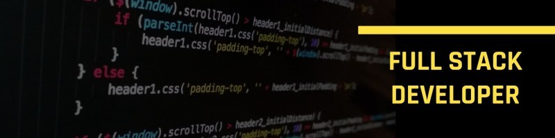

<h1 align="center">Hi 👋, I'm Alex Nwamu</h1>
<h3 align="center">A Fullstack Developer</h3>

- 🔭 I’m currently working on some **highly performant systems**
- 🌱 I’m currently learning **Rust**
- 👨‍💻 My portfolio website is [here](https://dinaka.vercel.app/)
- 💬 Ask me about **NextJS, Flutter and AI**
- 📫 How to reach me **dinakanwamu@gmail.com**
- 📄 Know about my experiences [My resume](https://drive.google.com/file/d/1bZqvXE-OgPCFCIueHp4U-dcgsVPXb-GS/view)
- ⚡ Fun fact **I love fitness**

---

### 🌐 Connect with me

---

### 🛠 Languages and Tools

